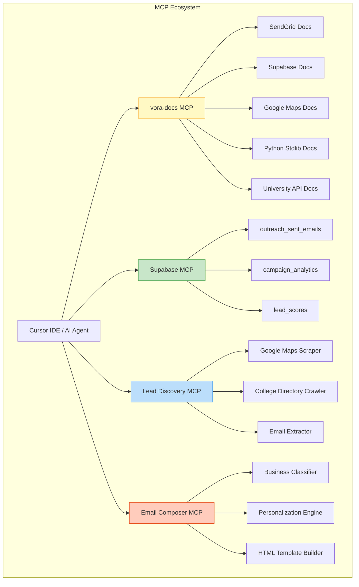
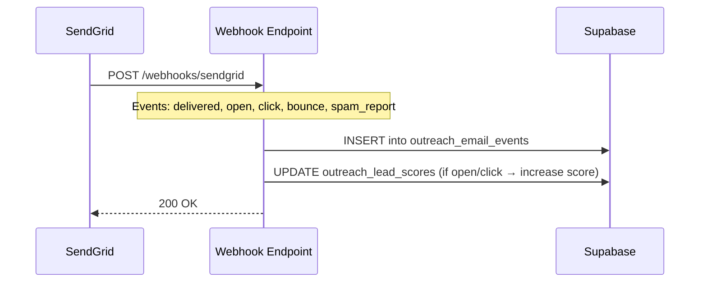
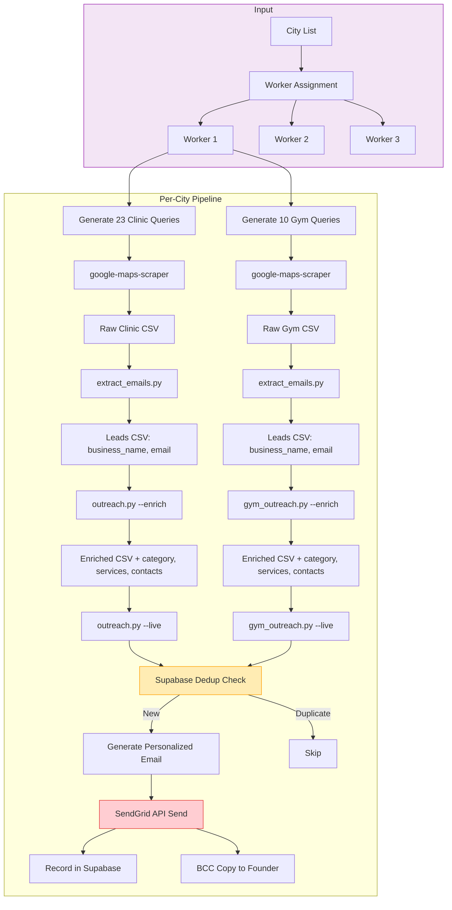

<p align="center">
  
</p>

<h1 align="center">VORA OUTREACH SYSTEM</h1>
<p align="center"><strong>Intelligent B2B Lead Discovery, Enrichment & Personalized Outreach Engine</strong></p>

<p align="center">
  <code>v2.0</code> · <code>February 2026</code> · <code>Vora AI Inc</code>
</p>

<p align="center">
  
  
  
  
  
</p>

---

> **What is this?** This document is the complete technical blueprint for Vora's outreach system — a multi-stage pipeline that discovers health, fitness, and wellness businesses via Google Maps, extracts and enriches contact information, generates deeply personalized emails, and delivers them at scale via SendGrid with full deduplication tracking in Supabase. It also maps the roadmap for college/university outreach, a custom Documentation MCP, and AI-driven personalization.

---

## Table of Contents

1. [System Architecture Overview](#1-system-architecture-overview)
2. [Engineer Distribution](#2-engineer-distribution)
3. [MCP Architecture (Model Context Protocol)](#3-mcp-architecture-model-context-protocol)
   - 3.1 [Custom Documentation MCP](#31-custom-documentation-mcp-vora-docs)
   - 3.2 [Supabase MCP](#32-supabase-mcp-connected)
   - 3.3 [Lead Discovery MCP](#33-lead-discovery-mcp-planned)
   - 3.4 [Email Composer MCP](#34-email-composer-mcp-planned)
4. [API Integrations](#4-api-integrations)
   - 4.1 [Google Maps API / Scraper](#41-google-maps-api--scraper)
   - 4.2 [SendGrid Email API](#42-sendgrid-email-api)
   - 4.3 [Supabase REST API](#43-supabase-rest-api)
   - 4.4 [College Email Discovery API](#44-college-email-discovery-api-new)
5. [College & University Outreach Module](#5-college--university-outreach-module)
6. [Email Personalization Engine](#6-email-personalization-engine-deep-dive)
7. [Pipeline Architecture](#7-pipeline-architecture)
8. [Data Model & Schemas](#8-data-model--schemas)
9. [SendGrid Connection (Deep Dive)](#9-sendgrid-connection-deep-dive)
10. [Deployment & Operations](#10-deployment--operations)
11. [Roadmap & Milestones](#11-roadmap--milestones)
12. [Appendix](#12-appendix)

---

## 1. System Architecture Overview

The Vora Outreach System is a four-stage pipeline that turns a city name into personalized, category-aware B2B emails delivered to health and fitness business owners.

```
┌─────────────────────────────────────────────────────────────────────────────────┐
│                         VORA OUTREACH SYSTEM — HIGH LEVEL                       │
└─────────────────────────────────────────────────────────────────────────────────┘

  ┌──────────┐    ┌──────────────┐    ┌───────────────┐    ┌──────────────────┐
  │ DISCOVERY │───▶│ INTELLIGENCE │───▶│ PERSONALIZE   │───▶│    DELIVERY      │
  │           │    │              │    │               │    │                  │
  │ Google    │    │ Web Scrape   │    │ 18 Categories │    │ SendGrid API     │
  │ Maps API  │    │ Enrich Data  │    │ Contact Match │    │ HTML Emails      │
  │ College   │    │ Classify Biz │    │ Custom Copy   │    │ BCC Tracking     │
  │ Dirs      │    │ Find Owners  │    │ LLM Hooks     │    │ Supabase Dedup   │
  └──────────┘    └──────────────┘    └───────────────┘    └──────────────────┘
       │                 │                    │                      │
       ▼                 ▼                    ▼                      ▼
  ┌──────────┐    ┌──────────────┐    ┌───────────────┐    ┌──────────────────┐
  │ 33 query │    │ Enriched CSV │    │ Per-biz email │    │ Supabase logs    │
  │ types    │    │ with meta    │    │ with greeting │    │ bounce tracking  │
  │ per city │    │ contacts,    │    │ opening, VP,  │    │ campaign stats   │
  │          │    │ services     │    │ CTA, fit text │    │                  │
  └──────────┘    └──────────────┘    └───────────────┘    └──────────────────┘
```

### Mermaid: End-to-End Pipeline

```mermaid
flowchart LR
    subgraph Discovery
        A[City Input] --> B[Generate Queries]
        B --> C[Google Maps Scraper]
        C --> D[Raw CSV]
        D --> E[Email Extractor]
        E --> F[Leads CSV]
    end

    subgraph Intelligence
        F --> G[Web Scraper]
        G --> H[Meta Extraction]
        H --> I[Contact Finder]
        I --> J[Service Classifier]
        J --> K[Business Categorizer]
        K --> L[Enriched CSV]
    end

    subgraph Personalization
        L --> M[Greeting Builder]
        M --> N[Opening Hook Generator]
        N --> O[Category Value Props]
        O --> P[Fit Reason Matcher]
        P --> Q[HTML Email Builder]
    end

    subgraph Delivery
        Q --> R{Supabase Dedup Check}
        R -->|New| S[SendGrid API]
        R -->|Duplicate| T[Skip]
        S --> U[Record in Supabase]
        S --> V[BCC to Founder]
    end

    style Discovery fill:#e8f5e9,stroke:#4caf50
    style Intelligence fill:#e3f2fd,stroke:#2196f3
    style Personalization fill:#fff3e0,stroke:#ff9800
    style Delivery fill:#fce4ec,stroke:#e91e63
```



### Key Metrics (Current)

| Metric | Value |
|--------|-------|
| Cities Covered | 44+ (Orange County, CA) |
| Business Types Searched | 23 clinic + 10 gym/fitness |
| Leads per City | ~200-460 |
| Emails Sent | 2,000+ |
| Unique Business Categories | 18 (8 clinic + 10 gym) |
| Personalization Variables | 7 per email |
| Dedup Accuracy | 100% (Supabase global check) |
| Send Rate | 1 email/second (SendGrid limit) |
| Parallel Workers | 2-3 concurrent city pipelines |

---

## 2. Engineer Distribution

### Team Structure

```
┌─────────────────────────────────────────────────────┐
│              VORA OUTREACH ENGINEERING               │
│                                                     │
│  ┌─────────────┐  ┌─────────────┐  ┌────────────┐  │
│  │   Pod 1     │  │   Pod 2     │  │   Pod 3    │  │
│  │  DISCOVERY  │  │ INTELLIGENCE│  │  DELIVERY  │  │
│  │  & SCRAPING │  │ & ENRICHMENT│  │  & INFRA   │  │
│  └─────────────┘  └─────────────┘  └────────────┘  │
│                                                     │
│         ┌──────────────────────────┐                │
│         │        Pod 4             │                │
│         │   MCP & TOOLING          │                │
│         └──────────────────────────┘                │
└─────────────────────────────────────────────────────┘
```

### Pod Assignments & Responsibilities

#### Pod 1: Discovery & Scraping

| Role | Focus Area | Key Deliverables |
|------|-----------|-----------------|
| **Lead Engineer** | Google Maps integration | Places API migration, query optimization |
| **Scraping Engineer** | Web crawling infrastructure | Email extractor, anti-bot handling, proxy rotation |
| **Data Engineer** | College directory integration | `.edu` scrapers, university API connectors |

**Owns:**
- `find_leads.sh` — Clinic lead scraper (23 business types)
- `find_gym_leads.sh` — Gym/fitness lead scraper (10+ business types)
- `extract_emails.py` — Website email extraction engine
- Google Maps scraper binary management
- College/university directory crawlers (new)
- Proxy infrastructure and rate limiting

**Current Stack:** Bash, Python, `gosom/google-maps-scraper` binary, `urllib`

---

#### Pod 2: Intelligence & Enrichment

| Role | Focus Area | Key Deliverables |
|------|-----------|-----------------|
| **ML Engineer** | Business classification | Category taxonomy, service keyword matching |
| **NLP Engineer** | Contact extraction & personalization | Name/title parsing, role detection, opening hooks |
| **Data Analyst** | Lead quality & scoring | Enrichment metrics, data quality monitoring |

**Owns:**
- `outreach.py` — Clinic enrichment + email generation (lines 1-1296)
- `gym_outreach.py` — Gym enrichment + email generation (lines 1-1429)
- Business classification system (18 categories)
- Contact extraction engine (regex patterns for MD, DPT, DC, CSCS, CPT, etc.)
- Service keyword matching (60+ service types)
- `build_personalized_opening()` — Scraped-data-driven email openers
- Value props, fit reasons, retention lines per category

**Current Stack:** Python, regex, `urllib`, HTML parsing

---

#### Pod 3: Delivery & Infrastructure

| Role | Focus Area | Key Deliverables |
|------|-----------|-----------------|
| **Backend Engineer** | SendGrid integration | Email sending, templates, webhook handling |
| **Platform Engineer** | Supabase & dedup system | Database schema, RLS, analytics queries |
| **DevOps Engineer** | Pipeline orchestration | Parallel workers, logging, monitoring |

**Owns:**
- `send_emails.py` — Base email sender via SendGrid
- SendGrid API connection (`POST /v3/mail/send`)
- Supabase deduplication system (`outreach_sent_emails` table)
- `run_combined_pipeline.sh` — Parallel city processing (2-3 workers)
- `run_gym_pipeline.sh`, `run_gym_parallel.sh` — Gym-specific pipelines
- BCC tracking, error handling, junk email blacklist
- Rate limiting (1 email/sec)

**Current Stack:** Python, SendGrid SDK, Supabase REST API, Bash

---

#### Pod 4: MCP & Tooling

| Role | Focus Area | Key Deliverables |
|------|-----------|-----------------|
| **MCP Architect** | Custom MCP server development | Documentation MCP, Lead Discovery MCP, Email Composer MCP |
| **DX Engineer** | Developer experience & AI tooling | Cursor integration, MCP schemas, tool definitions |
| **Integration Engineer** | API connectors | Third-party API wrappers, authentication flows |

**Owns:**
- Custom Documentation MCP server (`vora-docs`)
- Lead Discovery MCP server (wraps Google Maps + college directories)
- Email Composer MCP server (wraps personalization engine)
- Supabase MCP configuration (already connected)
- MCP tool schemas and resource definitions
- Developer onboarding documentation

**Current Stack:** TypeScript/Deno, MCP SDK, JSON Schema

---

### Responsibility Matrix (RACI)

| Task | Pod 1 | Pod 2 | Pod 3 | Pod 4 |
|------|-------|-------|-------|-------|
| Google Maps scraping | **R/A** | I | C | I |
| College email discovery | **R/A** | C | I | C |
| Business classification | C | **R/A** | I | I |
| Email personalization | I | **R/A** | C | I |
| Contact name extraction | I | **R/A** | I | I |
| SendGrid email sending | I | I | **R/A** | I |
| Supabase dedup system | I | I | **R/A** | C |
| Pipeline orchestration | C | I | **R/A** | I |
| Documentation MCP | I | C | C | **R/A** |
| Lead Discovery MCP | C | I | I | **R/A** |
| Email Composer MCP | I | C | I | **R/A** |

> **R** = Responsible · **A** = Accountable · **C** = Consulted · **I** = Informed

---

## 3. MCP Architecture (Model Context Protocol)

The system uses four MCP servers — one already connected, one custom-built, and two planned — that give AI agents real-time access to documentation, lead databases, and email composition tools.



---

### 3.1 Custom Documentation MCP (`vora-docs`)

> **Purpose:** An MCP server that crawls, indexes, and serves API documentation so AI agents can query real-time docs for SendGrid, Supabase, Google Maps, and university directory APIs while building features — without hallucinating outdated endpoints or parameters.

#### Why This Exists

When building outreach features, engineers (and AI agents) constantly need to reference:
- SendGrid's mail send endpoint parameters
- Supabase REST API filtering syntax
- Google Maps Places API field masks
- University directory schema formats

Instead of copy-pasting docs or relying on training data, the Documentation MCP makes all of this queryable in real-time.

#### Architecture

```
┌──────────────────────────────────────────────────────────────────┐
│                    vora-docs MCP Server                          │
│                                                                  │
│  ┌──────────┐    ┌──────────────┐    ┌───────────────────────┐  │
│  │  Crawler  │───▶│  Indexer     │───▶│  Search Engine        │  │
│  │          │    │  (Chunking + │    │  (Full-text + Semantic)│  │
│  │  Fetches │    │   Embeddings)│    │                       │  │
│  │  docs    │    │              │    │  Tools:               │  │
│  │  from    │    │  Stores in   │    │  - searchDocs         │  │
│  │  sources │    │  SQLite +    │    │  - getEndpoint        │  │
│  │          │    │  vector DB   │    │  - getCodeExample     │  │
│  └──────────┘    └──────────────┘    │  - listAPIs           │  │
│                                      └───────────────────────┘  │
│                                                                  │
│  Document Sources:                                               │
│  ├── SendGrid API Reference (v3)                                │
│  ├── Supabase Client Libraries (JS, Python)                     │
│  ├── Google Maps Places API (New)                               │
│  ├── Python stdlib (urllib, csv, re, json, ssl)                 │
│  ├── University Directory API schemas                           │
│  └── Internal: Vora email template reference                    │
└──────────────────────────────────────────────────────────────────┘
```

#### MCP Tool Definitions

```json
{
  "tools": [
    {
      "name": "searchDocs",
      "description": "Search across all indexed API documentation using natural language",
      "inputSchema": {
        "type": "object",
        "properties": {
          "query": {
            "type": "string",
            "description": "Natural language query, e.g. 'How do I send an email with BCC in SendGrid?'"
          },
          "source": {
            "type": "string",
            "enum": ["sendgrid", "supabase", "google_maps", "python", "university", "all"],
            "description": "Filter results to a specific documentation source"
          },
          "limit": {
            "type": "number",
            "default": 5,
            "description": "Number of results to return"
          }
        },
        "required": ["query"]
      }
    },
    {
      "name": "getEndpoint",
      "description": "Get detailed information about a specific API endpoint",
      "inputSchema": {
        "type": "object",
        "properties": {
          "api": {
            "type": "string",
            "enum": ["sendgrid", "supabase", "google_maps"]
          },
          "endpoint": {
            "type": "string",
            "description": "Endpoint path, e.g. '/v3/mail/send' or '/rest/v1/'"
          }
        },
        "required": ["api", "endpoint"]
      }
    },
    {
      "name": "getCodeExample",
      "description": "Get a working code example for a specific API operation",
      "inputSchema": {
        "type": "object",
        "properties": {
          "operation": {
            "type": "string",
            "description": "What you want to do, e.g. 'send HTML email with personalization'"
          },
          "language": {
            "type": "string",
            "enum": ["python", "typescript", "curl"],
            "default": "python"
          }
        },
        "required": ["operation"]
      }
    },
    {
      "name": "listAPIs",
      "description": "List all indexed API sources and their coverage stats",
      "inputSchema": {
        "type": "object",
        "properties": {}
      }
    }
  ]
}
```

#### MCP Resources

```json
{
  "resources": [
    {
      "uri": "vora-docs://sendgrid/endpoints",
      "name": "SendGrid API Endpoints",
      "description": "Complete list of SendGrid v3 API endpoints with methods and descriptions"
    },
    {
      "uri": "vora-docs://supabase/tables",
      "name": "Supabase Table Schemas",
      "description": "Current database schema for all Vora outreach tables"
    },
    {
      "uri": "vora-docs://google-maps/place-fields",
      "name": "Google Maps Place Fields",
      "description": "All available fields from the Places API (New) with types"
    },
    {
      "uri": "vora-docs://templates/email-categories",
      "name": "Email Category Templates",
      "description": "All 18 business category templates with value props, fit reasons, and hooks"
    }
  ]
}
```

#### Example Usage in Cursor

```
Agent: "How do I add open tracking to SendGrid emails?"

→ vora-docs MCP searchDocs({
    query: "open tracking sendgrid",
    source: "sendgrid"
  })

→ Returns: SendGrid Tracking Settings API
  POST /v3/tracking_settings/open
  {
    "enabled": true
  }
  
  Or per-message: add tracking_settings.open_tracking to mail/send payload
```

#### Doc Crawl Schedule

| Source | URL Pattern | Refresh Interval | Pages Indexed |
|--------|------------|-----------------|---------------|
| SendGrid API | `docs.sendgrid.com/api-reference/*` | Weekly | ~120 |
| Supabase Docs | `supabase.com/docs/reference/*` | Weekly | ~200 |
| Google Maps | `developers.google.com/maps/documentation/*` | Bi-weekly | ~80 |
| Python stdlib | `docs.python.org/3/library/*` | Monthly | ~40 |
| University APIs | Various `.edu/api/*` endpoints | Monthly | ~30 |
| Vora Internal | Local template reference | On change | ~20 |

---

### 3.2 Supabase MCP (Connected)

> **Status: ✅ Active** — Already connected to the Cursor IDE via the `supabase` MCP server.

#### Current Capabilities

| Tool | Description | Used For |
|------|------------|---------|
| `list_tables` | List all tables in schemas | Schema exploration |
| `execute_sql` | Run raw SQL queries | Dedup checks, analytics |
| `apply_migration` | Run DDL migrations | Schema changes |
| `get_logs` | Fetch service logs | Debugging send failures |
| `get_advisors` | Security/performance checks | RLS policy validation |
| `generate_typescript_types` | Type generation | Frontend type safety |

#### Connected Tables

```sql
-- Primary deduplication table
CREATE TABLE outreach_sent_emails (
    id          BIGSERIAL PRIMARY KEY,
    email       TEXT NOT NULL UNIQUE,
    business_name TEXT NOT NULL,
    city        TEXT NOT NULL,
    category    TEXT DEFAULT '',
    status      TEXT DEFAULT 'sent',
    created_at  TIMESTAMPTZ DEFAULT now()
);

-- Index for fast dedup lookups
CREATE INDEX idx_sent_emails_email ON outreach_sent_emails(email);
CREATE INDEX idx_sent_emails_city ON outreach_sent_emails(city);
```

#### Planned Tables

```sql
-- Campaign tracking
CREATE TABLE outreach_campaigns (
    id          BIGSERIAL PRIMARY KEY,
    campaign_name TEXT NOT NULL,
    city        TEXT NOT NULL,
    business_type TEXT NOT NULL,  -- 'clinic' or 'gym'
    started_at  TIMESTAMPTZ DEFAULT now(),
    completed_at TIMESTAMPTZ,
    total_leads INT DEFAULT 0,
    total_sent  INT DEFAULT 0,
    total_skipped INT DEFAULT 0,
    total_failed INT DEFAULT 0
);

-- Email event tracking (via SendGrid webhooks)
CREATE TABLE outreach_email_events (
    id          BIGSERIAL PRIMARY KEY,
    email       TEXT NOT NULL,
    event_type  TEXT NOT NULL,  -- 'open', 'click', 'bounce', 'unsubscribe'
    timestamp   TIMESTAMPTZ DEFAULT now(),
    metadata    JSONB DEFAULT '{}'
);

-- Lead scoring
CREATE TABLE outreach_lead_scores (
    id          BIGSERIAL PRIMARY KEY,
    email       TEXT NOT NULL,
    business_name TEXT,
    score       INT DEFAULT 0,  -- 0-100
    signals     JSONB DEFAULT '{}',
    -- signals: { has_website: true, has_contact_name: true, review_count: 45, ... }
    updated_at  TIMESTAMPTZ DEFAULT now()
);

-- College contacts
CREATE TABLE college_contacts (
    id          BIGSERIAL PRIMARY KEY,
    university  TEXT NOT NULL,
    department  TEXT,
    name        TEXT,
    email       TEXT NOT NULL UNIQUE,
    role        TEXT,  -- 'student', 'faculty', 'staff', 'rec_center'
    source_url  TEXT,
    created_at  TIMESTAMPTZ DEFAULT now()
);
```

---

### 3.3 Lead Discovery MCP (Planned)

> **Status: 🔵 Planned** — Wraps the Google Maps scraper and college directory crawler into MCP tools that AI agents can invoke directly.

#### Tool Definitions

```json
{
  "tools": [
    {
      "name": "search_businesses",
      "description": "Search for businesses in a city using Google Maps",
      "inputSchema": {
        "type": "object",
        "properties": {
          "city": { "type": "string", "description": "City and state, e.g. 'Irvine, CA'" },
          "business_type": {
            "type": "string",
            "enum": ["clinic", "gym", "all"],
            "default": "all"
          },
          "limit": { "type": "number", "default": 100 }
        },
        "required": ["city"]
      }
    },
    {
      "name": "search_college_contacts",
      "description": "Search university directories for wellness/fitness-related contacts",
      "inputSchema": {
        "type": "object",
        "properties": {
          "university": { "type": "string", "description": "University name or domain" },
          "department": {
            "type": "string",
            "enum": ["rec_center", "kinesiology", "athletics", "health_center", "wellness", "all"],
            "default": "all"
          },
          "role": {
            "type": "string",
            "enum": ["student", "faculty", "staff", "all"],
            "default": "all"
          }
        },
        "required": ["university"]
      }
    },
    {
      "name": "extract_emails_from_url",
      "description": "Extract email addresses from a given website URL",
      "inputSchema": {
        "type": "object",
        "properties": {
          "url": { "type": "string" },
          "deep": { "type": "boolean", "default": true, "description": "Also crawl /contact, /about pages" }
        },
        "required": ["url"]
      }
    },
    {
      "name": "get_city_coverage",
      "description": "Check which cities have already been scraped",
      "inputSchema": {
        "type": "object",
        "properties": {}
      }
    }
  ]
}
```

---

### 3.4 Email Composer MCP (Planned)

> **Status: 🔵 Planned** — Exposes the personalization engine as MCP tools for real-time email generation and preview.

#### Tool Definitions

```json
{
  "tools": [
    {
      "name": "classify_business",
      "description": "Classify a business into one of 18 categories based on name, services, and description",
      "inputSchema": {
        "type": "object",
        "properties": {
          "business_name": { "type": "string" },
          "services": { "type": "array", "items": { "type": "string" } },
          "description": { "type": "string" }
        },
        "required": ["business_name"]
      }
    },
    {
      "name": "generate_email",
      "description": "Generate a complete personalized outreach email for a business",
      "inputSchema": {
        "type": "object",
        "properties": {
          "business_name": { "type": "string" },
          "email": { "type": "string" },
          "category": { "type": "string" },
          "contact_name": { "type": "string" },
          "services": { "type": "array", "items": { "type": "string" } },
          "description": { "type": "string" }
        },
        "required": ["business_name", "email"]
      }
    },
    {
      "name": "preview_email",
      "description": "Generate an email and return HTML preview without sending",
      "inputSchema": {
        "type": "object",
        "properties": {
          "business_name": { "type": "string" },
          "category": { "type": "string" }
        },
        "required": ["business_name"]
      }
    },
    {
      "name": "list_categories",
      "description": "List all 18 business categories with their keywords and value props",
      "inputSchema": {
        "type": "object",
        "properties": {}
      }
    }
  ]
}
```

---

## 4. API Integrations

### 4.1 Google Maps API / Scraper

#### Current Implementation

The system uses the [`gosom/google-maps-scraper`](https://github.com/gosom/google-maps-scraper) open-source binary to query Google Maps and extract business data.

```bash
# Binary location
bin/google-maps-scraper

# Execution
bin/google-maps-scraper \
  -input .temp_queries_$$.txt \   # One query per line
  -results results/city.csv \     # Output CSV
  -depth 1 \                      # Scrape depth
  -exit-on-inactivity 3m \        # Timeout
  -c 4                            # Concurrency
```

#### Search Query Generation

For each city, the system generates queries from two lists:

**Clinic Queries (23 types):**

| # | Business Type | Example Query |
|---|--------------|---------------|
| 1 | Physical therapy clinic | `physical therapy clinic Irvine CA` |
| 2 | Rehabilitation center | `rehabilitation center Irvine CA` |
| 3 | Orthopedic clinic | `orthopedic clinic Irvine CA` |
| 4 | Sports medicine clinic | `sports medicine clinic Irvine CA` |
| 5 | Chiropractic clinic | `chiropractic clinic Irvine CA` |
| 6 | Pain management clinic | `pain management clinic Irvine CA` |
| 7 | Wellness center | `wellness center Irvine CA` |
| 8 | Occupational therapy clinic | `occupational therapy clinic Irvine CA` |
| 9 | Integrative medicine clinic | `integrative medicine clinic Irvine CA` |
| 10 | Outpatient rehabilitation | `outpatient rehabilitation Irvine CA` |
| 11 | Physical medicine clinic | `physical medicine clinic Irvine CA` |
| 12 | Musculoskeletal clinic | `musculoskeletal clinic Irvine CA` |
| 13 | Spine clinic | `spine clinic Irvine CA` |
| 14 | Joint clinic | `joint clinic Irvine CA` |
| 15 | Mobility specialist | `mobility specialist Irvine CA` |
| 16 | Movement disorder clinic | `movement disorder clinic Irvine CA` |
| 17 | Neurological rehabilitation | `neurological rehabilitation Irvine CA` |
| 18 | Post surgical rehabilitation | `post surgical rehabilitation Irvine CA` |
| 19 | Chronic pain clinic | `chronic pain clinic Irvine CA` |
| 20 | Functional medicine clinic | `functional medicine clinic Irvine CA` |
| 21 | Holistic health clinic | `holistic health clinic Irvine CA` |
| 22 | Preventive medicine clinic | `preventive medicine clinic Irvine CA` |
| 23 | Lifestyle medicine clinic | `lifestyle medicine clinic Irvine CA` |

**Gym/Fitness Queries (10+ types):**

| # | Business Type | Example Query |
|---|--------------|---------------|
| 1 | CrossFit gym | `crossfit gym Irvine CA` |
| 2 | Bootcamp / HIIT | `bootcamp Irvine CA` |
| 3 | Personal training studio | `personal training studio Irvine CA` |
| 4 | Stretch / recovery studio | `stretch studio Irvine CA` |
| 5 | Yoga studio | `yoga studio Irvine CA` |
| 6 | Pilates studio | `pilates studio Irvine CA` |
| 7 | Martial arts gym | `martial arts gym Irvine CA` |
| 8 | Cycling / spin studio | `spin studio Irvine CA` |
| 9 | Gym / fitness center | `gym Irvine CA` |
| 10 | Sports performance center | `sports performance center Irvine CA` |

#### Planned: Google Maps Places API (New) Migration

```python
# Future: Direct API integration
import googlemaps

gmaps = googlemaps.Client(key=GOOGLE_MAPS_API_KEY)

# Text Search (New)
results = gmaps.places(
    query="physical therapy clinic",
    location=(33.6846, -117.8265),  # Irvine, CA
    radius=15000,
    type="health"
)

# Fields available via Places API (New)
PLACE_FIELDS = [
    "displayName",
    "formattedAddress", 
    "nationalPhoneNumber",
    "websiteUri",
    "googleMapsUri",
    "rating",
    "userRatingCount",
    "businessStatus",
    "types",
    "regularOpeningHours",
    "editorialSummary",
]
```

#### Performance

| Metric | Scraper Binary | Places API (Planned) |
|--------|---------------|---------------------|
| Cost | Free (OSS) | $17/1000 requests |
| Rate Limit | ~4 concurrent | 100 QPS |
| Data Quality | Good | Excellent |
| Email Extraction | Separate step | Separate step |
| Reliability | Depends on Google | API-guaranteed |
| Anti-bot Risk | Moderate | None |

---

### 4.2 SendGrid Email API

#### Connection Details

```
API Base:     https://api.sendgrid.com
API Version:  v3
Auth:         Bearer token (SENDGRID_API_KEY)
Sender:       jai@askvora.com (Jai Ashar)
```

#### Current Endpoint Usage

**`POST /v3/mail/send`** — Primary email sending endpoint

```python
from sendgrid import SendGridAPIClient
from sendgrid.helpers.mail import (
    Mail, Email, To, Bcc, Personalization, Content
)

message = Mail()
message.from_email = Email("jai@askvora.com", "Jai Ashar")
message.subject = "Lake Forest Chiropractic + Vora"

personalization = Personalization()
personalization.add_to(To("doctor@lakeforesttotalcare.com"))
personalization.add_bcc(Bcc("jai@askvora.com"))  # BCC tracking
message.add_personalization(personalization)

message.add_content(Content("text/html", html_content))

sg = SendGridAPIClient(SENDGRID_API_KEY)
response = sg.send(message)
# response.status_code: 202 = Accepted
```

#### Email Structure

```
From:     Jai Ashar <jai@askvora.com>
To:       {contact_email}
BCC:      jai@askvora.com
Subject:  {business_name} + Vora
Content:  text/html (personalized)

Headers:
  X-Campaign: vora-outreach-{city}-{category}
```

#### Planned SendGrid Features

| Feature | Endpoint | Purpose |
|---------|---------|---------|
| Open Tracking | `POST /v3/tracking_settings/open` | Track email opens |
| Click Tracking | `POST /v3/tracking_settings/click` | Track link clicks |
| Event Webhooks | `POST /v3/user/webhooks/event/settings` | Real-time bounce/open/click events → Supabase |
| Dynamic Templates | `POST /v3/templates` | Store templates server-side |
| Suppressions | `GET /v3/suppression/bounces` | Auto-remove bounced emails |
| Stats | `GET /v3/stats` | Campaign analytics |
| A/B Testing | `POST /v3/mail/send` (with `asm`) | Subject line testing |
| Scheduled Send | `send_at` parameter | Time-zone-aware delivery |

#### SendGrid Event Webhook Flow (Planned)



---

### 4.3 Supabase REST API

#### Connection

```
URL:      https://sjcxsrfjkjisegxzquxh.supabase.co
Auth:     anon key (JWT)
Protocol: PostgREST (REST wrapper over PostgreSQL)
```

#### Current Operations

**Dedup Check (before sending):**
```python
# Check if email was already sent to
url = f"{SUPABASE_URL}/rest/v1/outreach_sent_emails?email=eq.{email}&select=email&limit=1"
req = urllib.request.Request(url, headers={
    "apikey": SUPABASE_KEY,
    "Authorization": f"Bearer {SUPABASE_KEY}",
})
resp = urllib.request.urlopen(req, timeout=5)
data = json.loads(resp.read())
already_sent = len(data) > 0
```

**Record Sent Email:**
```python
# Record after successful send
payload = json.dumps({
    "email": email,
    "business_name": business_name,
    "city": city,
    "category": category,
    "status": "sent",
}).encode()

url = f"{SUPABASE_URL}/rest/v1/outreach_sent_emails"
req = urllib.request.Request(url, data=payload, headers={
    "apikey": SUPABASE_KEY,
    "Authorization": f"Bearer {SUPABASE_KEY}",
    "Content-Type": "application/json",
    "Prefer": "resolution=ignore-duplicates",  # Upsert behavior
}, method="POST")
```

---

### 4.4 College Email Discovery API (New)

#### Target Data Sources

| Source | Type | Data Available |
|--------|------|---------------|
| University staff directories | Web scraping | Name, email, title, department |
| Department "People" pages | Web scraping | Faculty/staff emails, research areas |
| Campus recreation websites | Web scraping | Facility contacts, program directors |
| LinkedIn Education Search | API | Student/alumni profiles |
| Rate My Professors | API | Professor names → cross-reference |
| IPEDS (Federal DB) | Public API | University metadata, enrollment data |
| Common `.edu` patterns | Pattern matching | `firstname.lastname@school.edu` |

#### Email Pattern Detection

```python
# Common university email patterns
UNIVERSITY_EMAIL_PATTERNS = [
    "{first}.{last}@{domain}",          # john.smith@uci.edu
    "{first}{last}@{domain}",           # johnsmith@uci.edu
    "{first_initial}{last}@{domain}",   # jsmith@uci.edu
    "{first}_{last}@{domain}",          # john_smith@uci.edu
    "{last}{first_initial}@{domain}",   # smithj@uci.edu
    "{first}.{last}@student.{domain}",  # john.smith@student.uci.edu
]

# Department-specific search paths
DEPARTMENT_PATHS = {
    "rec_center": [
        "/campusrec", "/recreation", "/fitness",
        "/campusrec/about/staff", "/recreation/contact",
    ],
    "kinesiology": [
        "/kinesiology", "/exercise-science", "/hms",
        "/kinesiology/people", "/kinesiology/faculty",
    ],
    "athletics": [
        "/athletics", "/sports", "/athletic-department",
        "/athletics/staff-directory",
    ],
    "health_center": [
        "/health", "/student-health", "/wellness",
        "/shc", "/counseling",
    ],
}
```

#### Target Universities (Phase 1 — California)

| University | Domain | Priority | Target Departments |
|-----------|--------|----------|-------------------|
| UC Irvine | `uci.edu` | High | Campus Rec, Kinesiology |
| UCLA | `ucla.edu` | High | Recreation, Exercise Science |
| USC | `usc.edu` | High | Rec Center, Biokinesiology |
| Chapman University | `chapman.edu` | High | Kinesiology, Athletics |
| Cal State Fullerton | `fullerton.edu` | Medium | Kinesiology, Rec Center |
| Cal State Long Beach | `csulb.edu` | Medium | Kinesiology, Rec Center |
| Loyola Marymount | `lmu.edu` | Medium | Athletics, Wellness |
| Pepperdine | `pepperdine.edu` | Medium | Wellness, Athletics |
| UC San Diego | `ucsd.edu` | Medium | Recreation, HMS |
| UC Santa Barbara | `ucsb.edu` | Medium | Recreation, Exercise Science |

---

## 5. College & University Outreach Module

### Overview

A dedicated module for reaching campus recreation directors, kinesiology professors, student athletes, and wellness organizations at universities. This segment requires fundamentally different messaging, tone, and value propositions than B2B clinic/gym outreach.

### Target Segments

```
┌─────────────────────────────────────────────────────────────────┐
│                 COLLEGE OUTREACH SEGMENTS                        │
├─────────────────────────────────────────────────────────────────┤
│                                                                 │
│  ┌──────────────────┐  ┌──────────────────┐                    │
│  │  CAMPUS REC      │  │  KINESIOLOGY     │                    │
│  │  CENTERS         │  │  DEPARTMENTS     │                    │
│  │                  │  │                  │                    │
│  │  • Facility Dir  │  │  • Department    │                    │
│  │  • Program Mgr   │  │    Chairs        │                    │
│  │  • Fitness Coord  │  │  • Professors    │                    │
│  │  • Group Fit Dir  │  │  • Research      │                    │
│  │  • Personal       │  │    Associates    │                    │
│  │    Training Lead  │  │  • Lab Directors │                    │
│  └──────────────────┘  └──────────────────┘                    │
│                                                                 │
│  ┌──────────────────┐  ┌──────────────────┐                    │
│  │  ATHLETICS       │  │  STUDENT ORGS    │                    │
│  │  DEPARTMENTS     │  │  & WELLNESS      │                    │
│  │                  │  │                  │                    │
│  │  • Athletic Dir   │  │  • Wellness Peer │                    │
│  │  • S&C Coaches    │  │    Educators     │                    │
│  │  • Sports Med     │  │  • Club Sports   │                    │
│  │    Physicians     │  │    Presidents    │                    │
│  │  • Team Trainers  │  │  • Pre-med/PT    │                    │
│  │  • Nutritionists  │  │    Student Orgs  │                    │
│  └──────────────────┘  └──────────────────┘                    │
│                                                                 │
│  ┌──────────────────┐                                          │
│  │  INDIVIDUAL      │                                          │
│  │  STUDENTS        │                                          │
│  │                  │                                          │
│  │  • Student       │                                          │
│  │    Athletes      │                                          │
│  │  • Kinesiology   │                                          │
│  │    Majors        │                                          │
│  │  • Fitness       │                                          │
│  │    Enthusiasts   │                                          │
│  │  • Pre-PT/Pre-   │                                          │
│  │    Med Students  │                                          │
│  └──────────────────┘                                          │
└─────────────────────────────────────────────────────────────────┘
```

### College Email Discovery Pipeline

```mermaid
flowchart TD
    A[University Name] --> B[Fetch Directory Pages]
    B --> C[/campusrec/staff]
    B --> D[/kinesiology/people]
    B --> E[/athletics/staff-directory]

    C --> F[Extract Names + Emails]
    D --> F
    E --> F

    F --> G{Email Found?}
    G -->|Yes| H[Validate Email]
    G -->|No| I[Pattern Generation]

    I --> J[Test Common Patterns]
    J --> K[SMTP Verify]
    K --> H

    H --> L[Classify Role]
    L --> M[student / faculty / staff / rec_center]
    M --> N[Store in Supabase college_contacts]
    N --> O[Feed to Email Composer]

    style A fill:#e8f5e9
    style N fill:#c8e6c9
    style O fill:#fff3e0
```

### Personalization for Academic Audience

Unlike B2B outreach to clinic/gym owners, academic outreach requires:

| Dimension | Business Outreach | Academic Outreach |
|-----------|------------------|------------------|
| **Tone** | Casual, founder-to-founder | Professional-casual, research-aware |
| **Value Prop** | Member retention, revenue | Student outcomes, research opportunity |
| **Hook** | "I saw your business on Google Maps" | "Your department's work in [field] is impressive" |
| **CTA** | "Grab time on my calendar" | "Would love to discuss a pilot program" |
| **Social Proof** | "80% retention rates" | "Used by X athletes, cited in Y studies" |
| **Subject Line** | "{Business} + Vora" | "Vora for {University} {Department}" |

### Example College Email Templates

**Campus Rec Director:**
```
Subject: Vora for UCI Campus Recreation

Hey {first_name},

I'm Jai, the founder of Vora. I was looking into the Campus Recreation 
programs at {university} and what you're offering students is really impressive.

Vora is an AI-powered health app that could be an incredible resource for 
your student community. It connects to 500+ wearables, builds personalized 
nutrition and fitness plans, and tracks recovery — basically like giving 
every student their own health coach.

A few ways this could work for {university}:
• Partner with your personal training program as a digital companion
• Offer it as a free resource for intramural/club sport athletes  
• Integrate with your wellness programming
• Use it as a data source for kinesiology research projects

Would love to explore a pilot program. Happy to set up a demo for your team.
```

**Kinesiology Professor:**
```
Subject: Research collaboration — Vora x {University} Kinesiology

Hi Dr. {last_name},

I'm Jai Ashar, founder of Vora (askvora.com). Your work in {research_area} 
at {university} caught my attention.

Vora is an AI health platform that aggregates data from 500+ wearables and 
generates personalized wellness plans. We're exploring research partnerships 
with kinesiology departments, and I think there could be a natural fit.

Potential collaboration areas:
• Wearable data access for student/faculty research projects
• Longitudinal health tracking studies with anonymized user data
• Exercise science validation studies
• Student practicum/capstone project partnerships

Would you be open to a 15-minute call to explore this?
```

---

## 6. Email Personalization Engine (Deep Dive)

### How Personalization Works Today

The system generates emails with **7 personalized variables** per message, all driven by scraped data:

```
┌─────────────────────────────────────────────────────────────────┐
│                  EMAIL PERSONALIZATION FLOW                      │
│                                                                 │
│  Input:  Business Name + Email + Scraped Website Data           │
│                                                                 │
│  ┌─────────────┐                                               │
│  │ 1. GREETING │──▶ "Hey Dr. Smith," or "Hey {Biz} Team,"     │
│  └─────────────┘    (uses extracted contact name)               │
│                                                                 │
│  ┌─────────────┐                                               │
│  │ 2. OPENING  │──▶ Personalized paragraph referencing their   │
│  │    HOOK     │    actual services, description, or specialty  │
│  └─────────────┘    (built from meta description + services)    │
│                                                                 │
│  ┌─────────────┐                                               │
│  │ 3. FIT      │──▶ Category-specific paragraph explaining     │
│  │    REASON   │    why Vora fits THEIR type of business       │
│  └─────────────┘    (1 of 18 category-specific blocks)          │
│                                                                 │
│  ┌─────────────┐                                               │
│  │ 4. VALUE    │──▶ Feature bullets customized by category     │
│  │    PROPS    │    (different for CrossFit vs. yoga vs. PT)    │
│  └─────────────┘                                               │
│                                                                 │
│  ┌─────────────┐                                               │
│  │ 5. SOCIAL   │──▶ Category-specific retention stat           │
│  │    PROOF    │    (e.g. "Boxes using Vora see 80% retention")│
│  └─────────────┘                                               │
│                                                                 │
│  ┌─────────────┐                                               │
│  │ 6. CTA      │──▶ Category-aware call to action              │
│  │             │    (Calendly + phone + reply)                  │
│  └─────────────┘                                               │
│                                                                 │
│  ┌─────────────┐                                               │
│  │ 7. SUBJECT  │──▶ "{Business Name} + Vora"                  │
│  └─────────────┘                                               │
└─────────────────────────────────────────────────────────────────┘
```

### Category Taxonomy (All 18 Types)

#### Clinic Categories (8)

| Category | Keywords | Member Term | Hook Theme |
|----------|---------|------------|------------|
| `gym` | gym, fitness center, health club | members | Get results, stay active |
| `physical_therapy` | physical therapy, rehab, physiotherapy | patients | Stay on track between visits |
| `chiropractic` | chiropractic, chiropractor, spine | patients | Keep progress between adjustments |
| `weight_loss` | weight loss, med spa, GLP-1, peptide | clients | Stay on track with transformation |
| `wellness` | wellness, holistic, integrative, functional | clients | Daily wellness companion |
| `sports_medicine` | sports medicine, athletic training | athletes | Optimize performance + recovery |
| `pain_management` | pain management, chronic pain | patients | Daily support alongside treatment |
| `medical` | medical, orthopedic, physician | patients | Smart companion between visits |

#### Gym/Fitness Categories (10)

| Category | Keywords | Member Term | Hook Theme |
|----------|---------|------------|------------|
| `crossfit` | crossfit, WOD, functional fitness | athletes | Train smarter, recover faster |
| `bootcamp` | bootcamp, HIIT, circuit training | members | Keep the fire burning 24/7 |
| `personal_training` | personal trainer, 1-on-1, coaching | clients | 24/7 coaching support |
| `stretch_recovery` | stretch, mobility, flexibility | clients | Daily mobility habits |
| `yoga` | yoga, vinyasa, bikram | students | Deepen practice beyond the mat |
| `pilates` | pilates, reformer, barre, lagree | clients | Total body wellness habits |
| `martial_arts` | martial arts, MMA, boxing, BJJ | athletes | Nutrition + recovery edge |
| `cycling_spin` | spin, cycling, indoor cycling | riders | Optimize on + off the bike |
| `gym` | gym, fitness center, health club | members | Results that keep memberships |
| `sports_performance` | sports performance, speed, agility | athletes | Data-driven performance edge |

### Contact Extraction

The system extracts decision-maker names from business websites using four regex patterns:

```python
# Pattern 1: "Dr. First Last" or "First Last, MD/DPT/DC..."
PROFESSIONAL_SUFFIXES = (
    'MD', 'DO', 'DPT', 'PT', 'DC', 'OD', 'PhD', 'NP', 'PA',
    'RN', 'CFMP', 'CTN', 'CTP', 'CSCS', 'OCS', 'SCS', 'LAc',
    'ND', 'DACM', 'DAOM', 'MPT', 'ATC', 'FAAPMR',
    # Gym-specific
    'CPT', 'ACE', 'NASM', 'ACSM', 'ISSA', 'NSCA',
    'RYT', 'E-RYT', 'CES', 'PES', 'FMS', 'CF-L1', 'CF-L2',
)

# Pattern 2: "Name — Role" (e.g. "John Smith - Owner")
DECISION_MAKER_ROLES = [
    'owner', 'founder', 'co-founder', 'ceo', 'president',
    'director', 'managing partner', 'principal', 'administrator',
    'practice manager', 'general manager', 'clinic director',
    'head coach', 'head trainer', 'studio manager', 'gym manager',
    'fitness director', 'program director',
]
```

### Opening Hook Generation Logic

The `build_personalized_opening()` function uses a priority cascade:

```
Priority 1: Scraped meta description contains domain-specific keywords
            → Generate a hook referencing their actual specialty
            → e.g. "Your approach to functional and integrative care is exactly
                    the kind of practice Vora was built to complement"

Priority 2: Services extracted from website
            → Reference their top 1-2 services
            → e.g. "You're doing great work in personal training and nutrition coaching"

Priority 3: Business name + category fallback
            → Generic but still category-aware opener
            → e.g. "Your chiropractic practice caught my eye"
```

### Planned: AI-Powered Personalization (v3)

```python
# Future: LLM-generated personalization
def generate_ai_opening(business_info: dict) -> str:
    """Use an LLM to generate a truly unique opening paragraph."""
    
    prompt = f"""
    You are writing a cold outreach email from Jai Ashar, CEO of Vora 
    (an AI health app), to a business.
    
    Business: {business_info['name']}
    Category: {business_info['category']}
    Description: {business_info['description']}
    Services: {', '.join(business_info['services'])}
    Contact: {business_info['contacts'][0]['name'] if business_info['contacts'] else 'Unknown'}
    
    Write a 2-sentence opening that:
    1. References something specific about their business (not generic)
    2. Naturally transitions to why Vora could help
    3. Sounds like a real person, not a template
    4. Is warm but professional
    
    Do NOT use phrases like "I hope this finds you well" or "I came across your business".
    """
    
    # Call via OpenAI / Anthropic / local model
    response = llm.generate(prompt, max_tokens=150, temperature=0.8)
    return response.text
```

### Planned: Follow-Up Sequence

```
Day 0:  Initial personalized email (current system)
Day 3:  "Quick follow-up" — shorter, references original email
Day 7:  "Value add" — share a relevant blog post or case study
Day 14: "Last touch" — breakup email with soft CTA
```

---

## 7. Pipeline Architecture

### Full Pipeline Flow



### Shell Scripts

| Script | Purpose | Workers | Input |
|--------|---------|---------|-------|
| `find_leads.sh` | Scrape clinics for a single city | 1 | City name |
| `find_gym_leads.sh` | Scrape gyms for a single city | 1 | City name |
| `run_combined_pipeline.sh` | Full clinic + gym pipeline, parallel | 2-3 | City arrays |
| `run_gym_pipeline.sh` | Gym-only pipeline | 1 | City name |
| `run_gym_parallel.sh` | Gym pipeline, multiple cities parallel | 2-3 | City arrays |

### Python Engines

| Script | Purpose | Modes |
|--------|---------|-------|
| `outreach.py` | Clinic enrichment + email sending | `--enrich`, `--single`, `--test`, `--live` |
| `gym_outreach.py` | Gym enrichment + email sending | `--enrich`, `--single`, `--test`, `--live` |
| `send_emails.py` | Basic email sender (legacy) | CSV input |
| `extract_emails.py` | Website email extraction | CSV input/output |

### Parallel Worker System

```bash
# run_combined_pipeline.sh distributes cities across workers:

WORKER1_CITIES=(
    "Mission Viejo, CA"
    "Newport Beach, CA"
    "Orange, CA"
    "Placentia, CA"
    "San Clemente, CA"
    "San Juan Capistrano, CA"
)

WORKER2_CITIES=(
    "Santa Ana, CA"
    "Seal Beach, CA"
    "Tustin, CA"
    "Villa Park, CA"
    "Westminster, CA"
    "Yorba Linda, CA"
)

# Each worker runs sequentially through its cities
# Workers run in parallel with each other
# Monitor via log files: results/combined_logs/worker{1,2}.log
```

---

## 8. Data Model & Schemas

### CSV Schemas

**Raw Leads CSV** (output of email extraction):

| Column | Type | Example |
|--------|------|---------|
| `business_name` | string | "Lake Forest Chiropractic" |
| `email` | string | "info@lakeforesttotalcare.com" |

**Enriched CSV** (output of `--enrich` step):

| Column | Type | Example |
|--------|------|---------|
| `business_name` | string | "Lake Forest Chiropractic" |
| `email` | string | "info@lakeforesttotalcare.com" |
| `website` | string | "https://lakeforesttotalcare.com" |
| `category` | string | "chiropractic" |
| `description` | string | "Comprehensive chiropractic care..." |
| `services` | string (`;` delimited) | "chiropractic care; massage therapy" |
| `contact_name` | string | "Dr. Robert Kim" |
| `contact_title` | string | "DC, Owner" |

### Junk Email Filtering

```python
# Domains automatically rejected
JUNK_DOMAINS = {
    'godaddy.com', 'mysite.com', 'domain.com', 'latofonts.com',
    'example.com', 'email.com', 'address.com', 'pixelspread.com',
    'typemade.mx', 'indiantypefoundry.com',
}

# Specific emails automatically rejected
JUNK_EMAILS = {
    'filler@godaddy.com', 'your@email.com', 'johnsmith@gmail.com',
    'contact@mysite.com', 'email@address.com', 'emailhere@email.com',
}

# Personal domains (used to skip website derivation, NOT to reject)
PERSONAL_EMAIL_DOMAINS = {
    'gmail.com', 'yahoo.com', 'hotmail.com', 'outlook.com',
    'aol.com', 'icloud.com', 'me.com', 'live.com',
    # ... 20+ more
}
```

---

## 9. SendGrid Connection (Deep Dive)

### Authentication Flow

```
┌──────────────────────────────────────────────────────────┐
│                  SENDGRID AUTH FLOW                       │
│                                                          │
│  .env file                                               │
│  ├── SENDGRID_API_KEY=SG.xxxxx...                       │
│  └── FROM_EMAIL=jai@askvora.com                          │
│                                                          │
│  ┌──────────┐    ┌──────────┐    ┌──────────────────┐   │
│  │ load_    │───▶│ SendGrid │───▶│ api.sendgrid.com │   │
│  │ dotenv() │    │ Client   │    │ POST /v3/mail/   │   │
│  │          │    │ init     │    │ send             │   │
│  └──────────┘    └──────────┘    └──────────────────┘   │
│                                                          │
│  Headers:                                                │
│    Authorization: Bearer SG.xxxxx...                     │
│    Content-Type: application/json                        │
└──────────────────────────────────────────────────────────┘
```

### Email Sending Pipeline

```python
# 1. Construct message
message = Mail()
message.from_email = Email("jai@askvora.com", "Jai Ashar")
message.subject = f"{business_name} + Vora"

# 2. Add personalization (To + BCC)
personalization = Personalization()
personalization.add_to(To(contact_email))
personalization.add_bcc(Bcc("jai@askvora.com"))
message.add_personalization(personalization)

# 3. Add HTML content
message.add_content(Content("text/html", personalized_html))

# 4. Send via API
sg = SendGridAPIClient(api_key)
response = sg.send(message)  # Returns 202 on success

# 5. Record in Supabase (post-send)
supabase_record_sent(email, business_name, city, category)
```

### Rate Limiting Strategy

```
Current:  1 email per second (time.sleep(1) between sends)
SendGrid: 100 emails/second (plan limit)
Headroom: 99x capacity for future scaling

Per-city batch:
  ~100-200 unique businesses per city
  ~2-4 minutes per city at 1/sec
  ~60-120 minutes for all 44 cities (sequential)
  ~20-40 minutes with 3 parallel workers
```

### Error Handling

```python
# Status codes handled:
#   200, 201, 202 → Success (email accepted by SendGrid)
#   400 → Bad request (malformed email)
#   401 → Invalid API key
#   403 → Forbidden (sender not verified)
#   429 → Rate limited (back off)
#   500 → SendGrid server error (retry)

try:
    sg = SendGridAPIClient(SENDGRID_API_KEY)
    response = sg.send(message)
    return response.status_code, None
except Exception as e:
    return None, str(e)
```

### Email HTML Template Structure

```html
<div style="font-family: -apple-system, ...; max-width: 600px; ...">

  <!-- 1. Greeting -->
  <p>Hey {first_name},</p>

  <!-- 2. Personal Opening (scraped-data-driven) -->
  <p>I'm Jai, the founder of Vora. {personalized_opening}</p>

  <!-- 3. Fit Reason (category-specific) -->
  <p>{fit_reason}</p>

  <!-- 4. Feature Bullets (category-specific) -->
  <ul>
    <li>Connect 500+ wearables...</li>
    <li>Personalized nutrition plans...</li>
    <li>Recovery protocols...</li>
    <!-- ... -->
  </ul>

  <!-- 5. Social Proof (category-specific retention stat) -->
  <p>{retention_line}</p>

  <!-- 6. Quick Links (YouTube, App Store, Website) -->
  <div style="background: #f8f9fa; border-radius: 10px; ...">
    📺 Watch a quick demo
    📱 Download on the App Store
    🌐 askvora.com
  </div>

  <!-- 7. CTA (category-specific) -->
  <p>{cta_with_calendly_phone_reply}</p>

  <!-- 8. Signature -->
  <div>
    [Vora Logo]
    Jai Ashar
    CEO, Vora
    (949) 276-1808
    jai@askvora.com
  </div>

  <!-- 9. Social Links -->
  X · Instagram · LinkedIn

  <!-- 10. Footer -->
  Vora AI Inc · Irvine, CA
  Unsubscribe link
</div>
```

---

## 10. Deployment & Operations

### Environment Variables

| Variable | Purpose | Required |
|----------|---------|----------|
| `SENDGRID_API_KEY` | SendGrid API authentication | Yes |
| `FROM_EMAIL` | Sender email address | Yes (default: `jai@askvora.com`) |
| `SUPABASE_URL` | Supabase project URL | Hardcoded |
| `SUPABASE_KEY` | Supabase anon key | Hardcoded |
| `GOOGLE_MAPS_API_KEY` | Google Maps API (planned) | Planned |

### File Structure

```
VoraBusinessFinder/
├── bin/
│   └── google-maps-scraper          # OSS scraper binary
├── results/
│   ├── *.csv                         # Clinic leads per city
│   ├── *_enriched.csv                # Enriched clinic data
│   └── gyms/
│       ├── *.csv                     # Gym leads per city
│       └── *_enriched.csv            # Enriched gym data
├── outreach.py                       # Clinic outreach engine (1296 lines)
├── gym_outreach.py                   # Gym outreach engine (1429 lines)
├── send_emails.py                    # Basic email sender
├── extract_emails.py                 # Website email extractor
├── find_leads.sh                     # Clinic scraping script
├── find_gym_leads.sh                 # Gym scraping script
├── run_combined_pipeline.sh          # Full parallel pipeline
├── run_gym_pipeline.sh               # Gym-only pipeline
├── run_gym_parallel.sh               # Parallel gym pipeline
├── completed_cities.txt              # City tracking (clinics)
├── completed_gym_cities.txt          # City tracking (gyms)
├── .env                              # API keys (not committed)
├── .gitignore
├── README.md                         # Quick start guide
└── VORA_OUTREACH_SYSTEM.md           # This document
```

### Monitoring

| What | How | Location |
|------|-----|----------|
| Pipeline progress | Worker log files | `results/combined_logs/worker*.log` |
| Emails sent count | Supabase query | `SELECT COUNT(*) FROM outreach_sent_emails` |
| City completion | Tracking files | `completed_cities.txt`, `completed_gym_cities.txt` |
| Send failures | Log grep | `grep "FAILED" results/combined_logs/*.log` |
| Dedup stats | Pipeline output | `Skipped dedup: N` in console output |
| Junk filter stats | Pipeline output | `Skipped junk: N` in console output |

---

## 11. Roadmap & Milestones

```
═══════════════════════════════════════════════════════════════════
                        VORA OUTREACH ROADMAP
═══════════════════════════════════════════════════════════════════

  Phase 1 ✅  FOUNDATION (Completed — Jan-Feb 2026)
  ─────────────────────────────────────────────────
  ✅ Google Maps scraper integration
  ✅ Email extraction from business websites
  ✅ Business classification (8 clinic categories)
  ✅ Personalized email generation (clinic-focused)
  ✅ SendGrid integration with BCC tracking
  ✅ Supabase dedup system
  ✅ City-by-city pipeline with tracking
  ✅ 44+ cities in Orange County covered

  Phase 2 ✅  GYM & FITNESS EXPANSION (Completed — Feb 2026)
  ─────────────────────────────────────────────────
  ✅ 10 gym/fitness categories added
  ✅ Gym-specific outreach engine (gym_outreach.py)
  ✅ Category-specific value props, fit reasons, bullets
  ✅ Parallel worker system (2-3 concurrent)
  ✅ Combined clinic + gym pipeline
  ✅ Enrichment step (web scraping for contacts, services)

  Phase 3 🔵  COLLEGE & UNIVERSITY MODULE (Q1 2026)
  ─────────────────────────────────────────────────
  ○ University directory crawler
  ○ .edu email pattern detection + verification
  ○ Campus rec center targeting
  ○ Kinesiology department outreach
  ○ Academic-tone email templates
  ○ Student athlete segment
  ○ Supabase college_contacts table

  Phase 4 🔵  MCP ECOSYSTEM (Q1-Q2 2026)
  ─────────────────────────────────────────────────
  ○ Custom Documentation MCP (vora-docs)
  ○ Lead Discovery MCP
  ○ Email Composer MCP
  ○ MCP tool schemas + resource definitions
  ○ Cursor IDE integration

  Phase 5 🔵  AI-POWERED PERSONALIZATION (Q2 2026)
  ─────────────────────────────────────────────────
  ○ LLM-generated email openings
  ○ Review sentiment analysis for hooks
  ○ Competitor-aware messaging
  ○ Follow-up email sequences (Day 3, 7, 14)
  ○ A/B testing via SendGrid
  ○ Seasonal/contextual hooks

  Phase 6 🔵  ANALYTICS & DASHBOARD (Q2-Q3 2026)
  ─────────────────────────────────────────────────
  ○ SendGrid event webhooks (opens, clicks, bounces)
  ○ Supabase analytics tables
  ○ Lead scoring system
  ○ Campaign performance dashboard
  ○ Response tracking + CRM integration

  Phase 7 🔵  MULTI-CHANNEL & SCALE (Q3 2026)
  ─────────────────────────────────────────────────
  ○ LinkedIn outreach integration
  ○ SMS follow-ups (Twilio)
  ○ Direct mail for high-value leads
  ○ Multi-state expansion (beyond CA)
  ○ Google Maps Places API migration
  ○ Proxy infrastructure for scale

═══════════════════════════════════════════════════════════════════
```

---

## 12. Appendix

### A. Complete City Coverage (Orange County, CA)

| # | City | Clinics | Gyms | Status |
|---|------|---------|------|--------|
| 1 | Aliso Viejo | ✅ | ✅ | Complete |
| 2 | Anaheim | ✅ | ✅ | Complete |
| 3 | Brea | ✅ | ✅ | Complete |
| 4 | Buena Park | ✅ | ✅ | Complete |
| 5 | Costa Mesa | ✅ | ✅ | Complete |
| 6 | Cypress | ✅ | ✅ | Complete |
| 7 | Dana Point | ✅ | ✅ | Complete |
| 8 | Fountain Valley | ✅ | ✅ | Complete |
| 9 | Fullerton | ✅ | ✅ | Complete |
| 10 | Garden Grove | ✅ | ✅ | Complete |
| 11 | Huntington Beach | ✅ | ✅ | Complete |
| 12 | Irvine | ✅ | ✅ | Complete |
| 13 | La Habra | ✅ | ✅ | Complete |
| 14 | La Palma | ✅ | ✅ | Complete |
| 15 | Laguna Beach | ✅ | ✅ | Complete |
| 16 | Laguna Hills | ✅ | ✅ | Complete |
| 17 | Laguna Niguel | ✅ | ✅ | Complete |
| 18 | Laguna Woods | ✅ | ✅ | Complete |
| 19 | Lake Forest | ✅ | ✅ | Complete |
| 20 | Los Alamitos | ✅ | ✅ | Complete |
| 21 | Mission Viejo | ✅ | ✅ | Complete |
| 22 | Newport Beach | ✅ | ✅ | Complete |
| 23 | Orange | ✅ | ✅ | Complete |
| 24 | Placentia | ✅ | ✅ | Complete |
| 25 | Rancho Santa Margarita | ✅ | ✅ | Complete |
| 26 | San Clemente | ✅ | ✅ | Complete |
| 27 | San Juan Capistrano | ✅ | ✅ | Complete |
| 28 | Santa Ana | ✅ | ✅ | Complete |
| 29 | Seal Beach | ✅ | ✅ | Complete |
| 30 | Stanton | ✅ | ✅ | Complete |
| 31 | Tustin | ✅ | ✅ | Complete |
| 32 | Villa Park | ✅ | ✅ | Complete |
| 33 | Westminster | ✅ | ✅ | Complete |
| 34 | Yorba Linda | ✅ | ✅ | Complete |

### B. Technology Stack Summary

| Layer | Technology | Purpose |
|-------|-----------|---------|
| Scraping | `gosom/google-maps-scraper` | Google Maps data extraction |
| Scraping | Python `urllib` | Website crawling + email extraction |
| Email | SendGrid API v3 | Transactional email delivery |
| Database | Supabase (PostgreSQL) | Dedup, tracking, analytics |
| Pipeline | Bash scripts | Orchestration, parallel workers |
| Personalization | Python (regex, string) | Classification, template generation |
| IDE | Cursor + MCP | AI-assisted development |
| MCP | Supabase MCP | Database operations |
| MCP (Planned) | `vora-docs` | Documentation search |
| MCP (Planned) | Lead Discovery MCP | Business/college search |
| MCP (Planned) | Email Composer MCP | Email generation |

### C. Quick Reference: Running the System

```bash
# ── Single City (Clinics) ──────────────────────
./find_leads.sh "Irvine, CA"                     # Scrape
python outreach.py results/irvine_ca.csv --enrich # Enrich
python outreach.py results/irvine_ca_enriched.csv --single  # Test 1
python outreach.py results/irvine_ca_enriched.csv --live     # Send all

# ── Single City (Gyms) ────────────────────────
./find_gym_leads.sh "Irvine, CA"
python gym_outreach.py results/gyms/irvine_ca.csv --enrich
python gym_outreach.py results/gyms/irvine_ca_enriched.csv --single
python gym_outreach.py results/gyms/irvine_ca_enriched.csv --live

# ── Full Pipeline (Parallel) ──────────────────
./run_combined_pipeline.sh    # Runs all cities, 2 workers

# ── Check Status ──────────────────────────────
cat completed_cities.txt           # Clinic progress
cat completed_gym_cities.txt       # Gym progress
tail -f results/combined_logs/worker1.log  # Live monitoring
```

---

<p align="center">
  <strong>Vora AI Inc</strong> · Irvine, CA · <a href="https://askvora.com">askvora.com</a>
</p>
<p align="center">
  <em>Built with purpose. Delivered with precision.</em>
</p>
